# Web-Based UI Implementation Plan for FamilyBot

This document outlines the detailed plan for implementing a web-based user interface for the FamilyBot project, as discussed in the project roadmap.

## Architecture Overview

The web-based UI will integrate with the existing FamilyBot system, leveraging the shared database and potentially extending the WebSocket server for real-time updates.



## Technology Stack Selection

- **Backend Framework**: **FastAPI** (Recommended over Flask)
  - **Pros**: Automatic API documentation, async support, type hints, modern Python
  - **Cons**: Slightly more complex than Flask
  - **Alternative**: Flask (simpler, but less feature-rich)

- **Frontend**: **HTML/CSS/JavaScript with Bootstrap** (Keep it simple)
  - **Pros**: No build process, easy to maintain, responsive design
  - **Alternative**: React/Vue (more complex but more interactive)

- **Real-time Updates**: **WebSocket** integration
  - Reuse existing WebSocket infrastructure
  - Add new endpoints for UI communication

## Implementation Phases

### Phase 1: Backend API Foundation

**Files to Create**:

- `src/familybot/web/` - New web module directory
- `src/familybot/web/api.py` - FastAPI application
- `src/familybot/web/models.py` - Pydantic models for API
- `src/familybot/web/routes/` - API route modules

**Core API Endpoints**:

```http
GET  /api/status          - Bot health and status
GET  /api/logs            - Recent log entries (paginated)
GET  /api/config          - Current configuration (sanitized)
POST /api/commands        - Execute bot commands
GET  /api/family-library  - Current family library data
GET  /api/wishlist        - Wishlist data
POST /api/cache/purge     - Cache management operations
```

### Phase 2: Database Integration

**Enhancements Needed**:

- Add web session management to existing database
- Create API-specific database queries
- Add logging table for web UI log viewing
- Implement proper authentication/authorization

### Phase 3: Frontend Dashboard

**Files to Create**:

- `src/familybot/web/static/` - CSS, JS, images
- `src/familybot/web/templates/` - HTML templates
- `src/familybot/web/templates/dashboard.html` - Main dashboard
- `src/familybot/web/templates/logs.html` - Log viewer
- `src/familybot/web/templates/config.html` - Configuration editor

**Dashboard Components**:

1. **Status Panel**: Bot online/offline, uptime, last activity
2. **Quick Actions**: Force commands, cache operations
3. **Recent Activity**: Latest games added, wishlist changes
4. **System Health**: Memory usage, database size, error counts
5. **Log Viewer**: Real-time log streaming with filters

### Phase 4: Integration with Main Bot

**Modifications to Existing Code**:

- Update `src/familybot/FamilyBot.py` to start web server
- Modify `src/familybot/WebSocketServer.py` to handle UI connections
- Add web server configuration to `config-template.yml`
- Update `pyproject.toml` dependencies

## Security Considerations

1. **Authentication**: Simple token-based auth or basic HTTP auth
2. **CORS**: Restrict to specific origins
3. **Rate Limiting**: Prevent API abuse
4. **Input Validation**: Sanitize all user inputs
5. **Configuration Exposure**: Never expose sensitive keys in API responses

## Configuration Changes Needed

Add to `config-template.yml`:

```yaml
web_ui:
  enabled: true
  host: "127.0.0.1"
  port: 8080
  auth_token: "your-secure-token-here"  # For API access
  cors_origins: ["http://localhost:8080"]
```

## Dependencies to Add

Update `pyproject.toml`:

```toml
dependencies = [
    # ... existing dependencies ...
    "fastapi>=0.104.0",
    "uvicorn>=0.24.0",
    "jinja2>=3.1.0",  # For HTML templates
    "python-multipart>=0.0.6",  # For form handling
]
```

## Development Approach

1. **Start Simple**: Basic status page and log viewer
2. **Iterate**: Add features incrementally
3. **Test Integration**: Ensure web UI doesn't interfere with Discord bot
4. **Security Review**: Implement proper authentication before deployment

## Estimated Implementation Time

- **Phase 1 (API Backend)**: 2-3 days
- **Phase 2 (Database Integration)**: 1-2 days
- **Phase 3 (Frontend)**: 3-4 days
- **Phase 4 (Integration)**: 1-2 days
- **Testing & Polish**: 2-3 days

**Total**: ~10-14 days of development time
