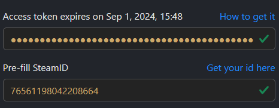
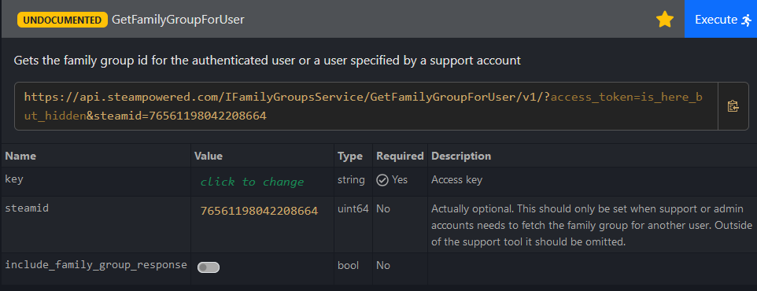

# Family Bot

## Introduction
Family Bot is a discord bot mainly made to get the new games that are added to the Steam Family library.  
Pluggins can be made to add functionnalities [interaction.py](https://interactions-py.github.io/interactions.py/) library.

## Instalation
to install the bot unzip the depo archive and install the requirements.
### Requierements
it's only compatible with python 3.10 and above.  
to install the required python lybrries use ``pip install -r requirements.txt`` 
### Discord bot Creation

To create your Bot, first go to https://discord.com/developers/applications and log in with your Discord account. Click on New Application and set the name you want for it.


First, in the installation part, set None to the install link.


Then, in the bot section, disable Public Bot and add all the privileges to the bot (currently, only the message content intent is used, but the other might be required in future updates).


Finally, to add the bot to your Discord server, go to OAuth2 and in the "scopes" part, check bot and in bot permissions, check "Administrator".

At the bottom, copy the generated URL and open it in a new tab.


It will ask you to connect and select the server where you want to add it.


Then, it will ask you to grant the administrator permissions; click on Authorize.

And voilà! Your bot is ready, and before leaving the Discord developer portal, you'll just need to get the Discord bot Token as it will be used to control the bot.

In the Bot part, click on "reset token" and copy the token and save it in a text file for the moment.
 
### Configuration
fill the required data in the ``config-template.yml`` file and rename it to ``config.yml``  
#### Discord ID
To get the Discord IDs, you will need to enable the developer mode in the advanced parameters of the app.  
Then, you can left-click on your profile picture in the lower left corner and copy your user ID.  
To get the Discord channels ID, just right-click on the channels and copy the ID of the channel. 
#### Steam ID

To get the Steam Family ID, we will use this site: https://steamapi.xpaw.me/
At the beginning of the site, you will need to fill the token and the Steam ID fields.

For the Steam ID, go to this site and paste your profile URL: https://steamdb.info/calculator/, then your Steam ID will be displayed like this:


And to get your Steam Token, use this link: https://store.steampowered.com/pointssummary/ajaxgetasyncconfig and copy the webapi_token value in quotes. If you don't have any value, log in to Steam in another tab, then refresh the token tab.

If the values you entered in the fields are correct, it will look like this:



After this, go to this link: https://steamapi.xpaw.me/#IFamilyGroupsService/GetFamilyGroupForUser and click on execute.



And you should get your family ID in quotes.

To get the other user IDs of your family, you can use https://steamdb.info/calculator/ with the URL of their profile. This will also allow you to know if their games are public or not.

#### Is There Any Deal API Key

To create an API key on Is There Any Deal, create an account on https://isthereanydeal.com/ when it's done and you're connected, go to https://isthereanydeal.com/apps/my/ and create a new app. Then, copy the API key by clicking here:


### Token Sender installation and configuration
#### Requirements
- Firefox
- Python 
#### Configure Firefox for Selenium

Unfortunately, since there is no other way to get the Steam token than getting it with a browser that is connected to the Steam account, I used Selenium to automatically gather the token and send it to the server through WebSocket.

So, for Selenium to achieve the token gathering, it needs to already be connected to Steam. To do this, in Firefox, you can create multiple profiles that keep cookies, extensions, etc.

You will need to create a new profile on Firefox. To do this, you must copy and paste this in the address bar: **about:profiles** then click on create a new profile. It will open a small window like this:


Note that it shows the path of the profile, and you will need it for the configuration.

When it's done, start the profile in a new browser and log in to [Steam](https://store.steampowered.com/). 

#### complete the configuration file
In the Token Sender 's config.yaml, just set the same IP address that you set in the bot config, and in **"token_save_path"**, the directory where you want to save the token. The shutdown property is to set to true if you want to shut down your computer after sending the token; you can change it even if the script is already started.

For the **"firefox_profile_path"** use the complete path and make sure to use **/** and not **\\** 

To start the script on startup, create a **.bat** script in *C:\Users\%username%\AppData\Roaming\Microsoft\Windows\Start Menu\Programs\Startup* like this:

```
python3.10.exe <SCRIPT_PATH>\getToken.py
```
## Features
### Steam_Family
this plugin include all the features related to the steam Family.
the curent features are:
- Send a notification when a new game is added to the Family library
- compare the wishlists to get the common game in the ideau to share the price between the multiple user tha wants the game
- ``!coop <number>`` command that returns all the multiplayer games in the family library in the given numbers of copies or more
 
### Free_Epicgames
Send a notification in a given channel about the new weekly free games on the Epicgames Store

### Common_Games
add the following commands:
- ``!register <SteamId>``: make the link beetween the discord id and the steam id
- ``!common_games @user1 @user2`` get the multiplayer games that are common to the sender Steam library and the tagged users
- ``!list_users`` Get the list of users that have linked their SteamID with their DiscordID using the ``!register`` command  

### Help_Message
It dinamicaly get make a help message for the pluggins commands if a comment formated as follow is in the code of the plugin:
```python
    """
    [help]|!commandName| Description of what the command does| !commandName Arguments | Comment about the command
    """
```
