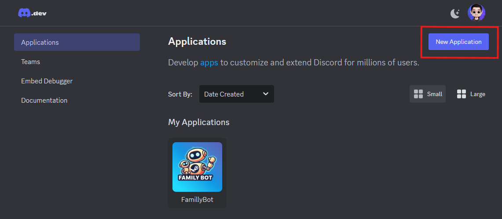
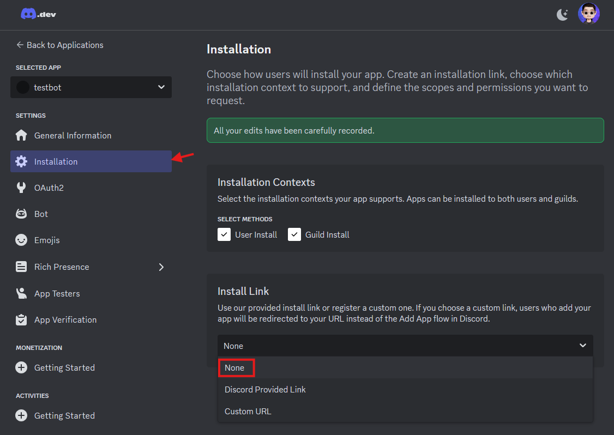
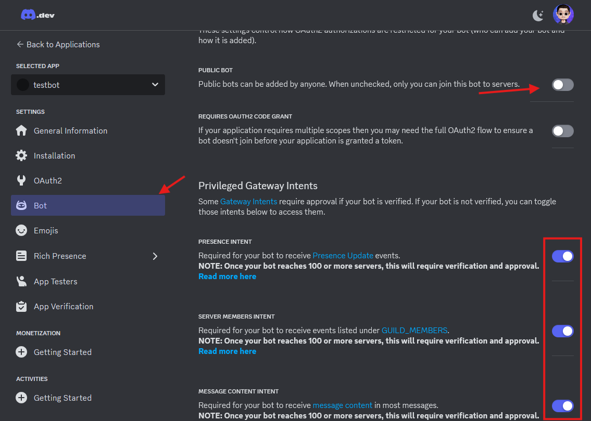
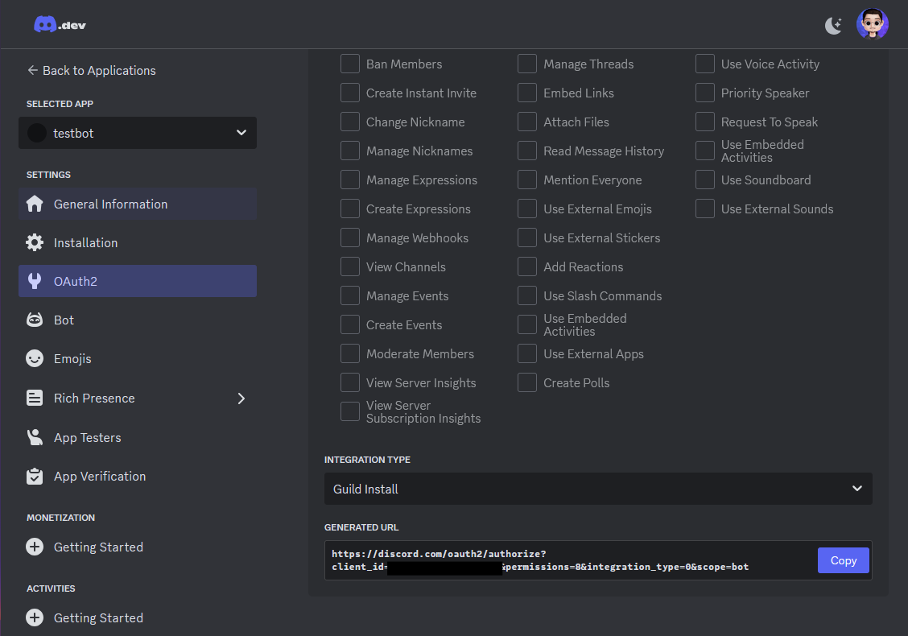

# Family Bot

## Introduction
Family Bot is a Discord bot primarily designed to retrieve new games added to the Steam Family library. Pluggins can be created using the Interaction.py library.

## Installation
To install the bot, unzip the deployment archive and install the requirements.
### Requirements
It's only compatible with Python 3.10 and above. To install the required Python libraries, use `pip install -r requirements.txt`.
### Discord Bot Creation

To create your Bot, follow these steps:

1. Go to https://discord.com/developers/applications and log in with your Discord account.
2. Click on New Application and set the name you want for it.



3. In the installation part, set None to the install link.



4. In the bot section, disable Public Bot and add all the privileges to the bot (currently, only the message content intent is used, but other permissions might be required in future updates).



5. To add the bot to your Discord server, go to OAuth2 and in the "scopes" part, check Bot and in bot permissions, check "Administrator".

At the bottom, copy the generated URL and open it in a new tab.



It will ask you to connect and select the server where you want to add it.

6. Then, it will ask you to grant administrator permissions; click on Authorize.

And voilà! Your bot is ready. Before leaving the Discord developer portal, you'll need to get the Discord bot Token as it will be used to control the bot.

In the Bot part, click on "reset token" and copy the token and save it in a text file for now.
 
### Configuration
Fill in the required data in the `config-template.yml` file and rename it to `config.yml`.
#### Discord ID

To get the Discord IDs, you need to enable Developer Mode in the advanced parameters of the app.

Then, left-click on your profile picture in the lower left corner and copy your Discord ID.

#### Steam Family
This plugin includes all the features related to the Steam Family.
The current features are:

- Send a notification when a new game is added to the Family library
- Compare wishlists to get common games to share prices between users who want the same game
- `!coop <number>` command that returns multiplayer games in the Family library with 1 or more copies

### Free Epic Games
Send a notification about new weekly free games on the Epic Games Store in a given channel.

### Common Games
Add the following commands:

- `!register <SteamId>`: Make a link between your Discord ID and Steam ID
- `!common_games @user1 @user2` Get multiplayer games common to your Steam library and tagged users
- `!list_users` Get the list of users who have linked their Steam ID with their Discord ID using the `!register` command

### Help Message
The plugin dynamically generates a help message for commands if a comment is in the code format:
```python
    """
    [help]|!commandName| Description of what the command does| !commandName Arguments | Comment about the command
    """
```