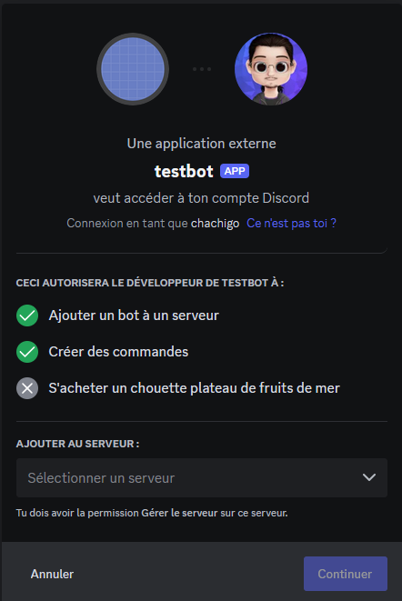
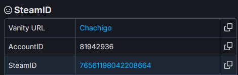
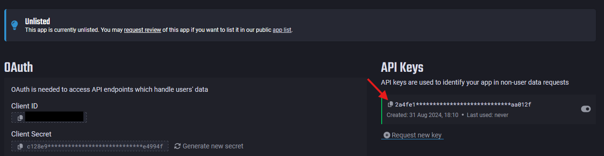
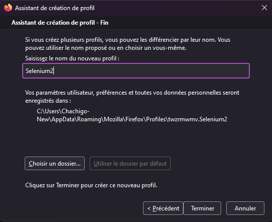

# Family Bot

This project is a modified version of the original "FamilyBot" created by Chachigo. I have made significant improvements and refactorings to the codebase.
**Original Source:** [Chachigo/FamilyBot](https://github.com/Chachigo/FamilyBot)


## Introduction
Family Bot is a Discord bot primarily designed to notify about new games that are added to the Steam Family library. Pluggins can be made to add functionalities [interactions.py](https://interactions-py.github.io/interactions.py/) library.

## Installation
To install the bot, clone or unzip the repository archive.

### Requirements
This bot is compatible with **Python 3.13 and above.**
We use `uv` for blazing-fast dependency management and virtual environment creation.

To set up your development environment, navigate to the project's root directory (`FamilyBot/`) in your terminal (PowerShell 7+ recommended on Windows, or Bash on macOS/Linux) and run the appropriate script:

**For Windows (PowerShell 7):**
```powershell
.\reinstall_bot.ps1
```

**For macOS/Linux (Bash):**

```bash
chmod +x ./reinstall_bot.sh # Make the script executable first
./reinstall_bot.sh
```

This script will:

* Create a new Python virtual environment (.venv).
* Install all necessary Python libraries (including interactions.py, selenium, PyYAML, requests, websockets, webdriver_manager) into the virtual environment.
* Ensure the project's internal modules are correctly configured.


### Discord Bot Creation

1.  Go to [https://discord.com/developers/applications](https://discord.com/developers/applications) and log in with your Discord account.
2.  Click on **New Application** and set the name you want for your bot.
3.  In the **"OAuth2" -> "General"** section, set the **"Install Link" to `None`**.
    
4.  Navigate to the **"Bot"** section:
    * Disable **"Public Bot"**.
    * Under **"Privileged Gateway Intents"**, enable all intents (currently, only the message content intent is essential, but others may be required in future updates).
    
5.  To add the bot to your Discord server, go to **"OAuth2" -> "URL Generator"**:
    * In the "scopes" part, check `bot`.
    * In "Bot Permissions", check `Administrator`.
    * Copy the generated URL at the bottom and open it in a new tab.
    
6.  It will ask you to connect and select the server where you want to add the bot.
    
7.  Grant the administrator permissions by clicking **Authorize**.
8.  Finally, to get your bot's token: In the **"Bot"** section, click on **"Reset Token"** and copy the token. Save it temporarily, as you'll need it for configuration.

### Configuration

The bot uses `config.yml` for its settings. Fill in the required data in the `config-template.yml` file and rename it to `config.yml`. This file should be placed in the **project's root directory** (`FamilyBot/`).

#### Discord IDs
To get Discord IDs (for yourself or channels):
* **User ID:** Enable Developer Mode in Discord's **User Settings -> App Settings -> Advanced**. Then, right-click on a user's profile picture and select "Copy ID".
* **Channel ID:** Right-click on a Discord channel and select "Copy ID".

#### Steam IDs and API Keys

The bot interacts with several Steam APIs. There are two distinct types of Steam keys/tokens you'll encounter:

1.  **Steamworks Web API Key:** Used for accessing most public Steam Web API endpoints (e.g., `IPlayerService/GetOwnedGames`, `IWishlistService/GetWishlist`, `IFamilyGroupsService/GetSharedLibraryApps`). This is a developer-specific key.
    * **To Obtain:** Go to [https://steamcommunity.com/dev/apikey](https://steamcommunity.com/dev/apikey). Register a domain (you can use `localhost` for development) and generate your key. This key goes into the `steamworks_api_key` field in your `config.yml`.

2.  **Steam Web API Token (`webapi_token`):** This is a client-side token, usually obtained from your browser session, and is specifically used by the `Token_Sender` bot for actions that might mimic browser interaction (e.g., if you had features related to Steam Points Shop or specific client-side Steam features).

    * **To Get `webapi_token`:** Go to [https://store.steampowered.com/pointssummary/ajaxgetasyncconfig](https://store.steampowered.com/pointssummary/ajaxgetasyncconfig). Log in to Steam in another tab, then refresh the token tab. Copy the `webapi_token` value (in quotes). This token is *automatically collected* by the `Token_Sender` bot using Selenium and sent to the main bot via WebSocket. You don't need to manually put this into `config.yml`.

#### Steam Family ID
To get your Steam Family ID:
1.  Use a site like [https://steamapi.xpaw.me/](https://steamapi.xpaw.me/).
2.  Fill in the "Token" and "Steam ID" fields on this site (you'll need a Steamworks Web API Key for the "Token" field for `xpaw.me` to function).
3.  For your Steam ID (SteamID64): Go to [https://steamdb.info/calculator/](https://steamdb.info/calculator/), paste your profile URL, and your Steam ID will be displayed.
    
4.  After the values are filled on `xpaw.me`, navigate to [https://steamapi.xpaw.me/#IFamilyGroupsService/GetFamilyGroupForUser](https://steamapi.xpaw.me/#IFamilyGroupsService/GetFamilyGroupForUser) and click "Execute".
5.  Your Family ID will be displayed in quotes.
6.  To get other family user IDs (SteamID64s), use [https://steamdb.info/calculator/](https://steamdb.info/calculator/) with their profile URLs.

#### IsThereAnyDeal API Key
1.  Create an account on [https://isthereanydeal.com/](https://isthereanydeal.com/).
2.  Once logged in, go to [https://isthereanydeal.com/apps/my/](https://isthereanydeal.com/apps/my/) and create a new application.
3.  Copy the API key displayed there.
    
	
	### Token Sender Installation and Configuration
The `Token_Sender` bot is a separate Python script (`getToken.py`) located in the `src/familybot/Token_Sender/` subdirectory. It requires:

* **Firefox** (installed on your system).
* **Python 3.13+** (managed by your bot's virtual environment).

#### Configure Firefox for Selenium
Since the `webapi_token` can only be reliably obtained from a browser logged into Steam, `Token_Sender` uses Selenium.
1.  You need to create a dedicated Firefox profile. In Firefox's address bar, type **`about:profiles`** and press Enter.
2.  Click on **"Create a New Profile"**.
    
3.  **Note the path of this new profile**, as you will need it for the `Token_Sender`'s configuration.
4.  Start this new profile in a new browser window and log in to [Steam](https://store.steampowered.com/).

#### Token Sender Configuration File
The `Token_Sender` bot has its own configuration. First, copy the template file `src/familybot/Token_Sender/config-template.yaml` to `src/familybot/Token_Sender/config.yaml`. Then, fill in the required data in `src/familybot/Token_Sender/config.yaml`:
* **`server_ip`**: The IP address of the main FamilyBot's WebSocket server. Use the same IP address you set for `websocket_server_ip` in the main bot's `config.yml` (e.g., `127.0.0.1` for local).
* **`token_save_path`**: The directory where the `webapi_token` and its expiration timestamp will be saved. We recommend using a relative path like `"tokens/"` (which will create a `FamilyBot/tokens/` folder).
* **`shutdown`**: Set to `true` if you want your computer to shut down after the token is successfully sent (mostly for dedicated systems; set to `false` for development).
* **`firefox_profile_path`**: The **complete path** to the Firefox profile you created in the previous step. Ensure you use **forward slashes (`/`)** or escaped backslashes (`\\`) in the path.

### Running the Bots
Both bots need to run concurrently in separate processes. From the `FamilyBot/` project root directory, run the appropriate script:

**For Windows (PowerShell 7):**
```powershell
.\run_bots.ps1
```
***For macOS/Linux (Bash):**
```bash
chmod +x ./run_bots.sh # Make the script executable first
./run_bots.sh
```
These scripts will launch both the main bot and the token sender in separate terminal windows, allowing them to operate concurrently.

### Stopping the Bots
To stop the bots, go to their respective terminal windows and press `Ctrl+C`. Both bots have graceful shutdown handling implemented.

## Features
### Steam Family
This plugin includes all features related to Steam Family:
* Sends a notification when a new game is added to the Family library.
* Compares wishlists to find common games, facilitating price sharing among multiple users who desire the same game.
* `!coop <number>`: A command that returns all multiplayer games in the family library in the given number of copies (or more).

### Free Epic Games
* Sends a notification in a designated channel about the new weekly free games on the Epic Games Store.
* `!force_epic`: An admin-only command (usable in DM) to manually trigger an Epic Games free game check.

### Common Games
Adds the following commands:
* `!register <SteamID>`: Links a Discord account to a Steam ID. (Usable in bot DMs).
* `!common_games @user1 @user2`: Gets multiplayer games common to the sender's Steam library and the tagged users. (Usable in bot DMs).
* `!list_users`: Gets the list of users who have linked their SteamID with their DiscordID using the `!register` command. The list is sent in DM. (Usable in bot DMs).

### Help Message
This plugin dynamically generates a help message for all plugin commands. It automatically extracts command details from docstrings formatted as follows within your plugin Python files:

```python
    """
    [help]|!commandName| Description of what the command does| !commandName Arguments | Comment about the command
    """
```	

	This ensures the help message is always up-to-date with your bot's latest features.
